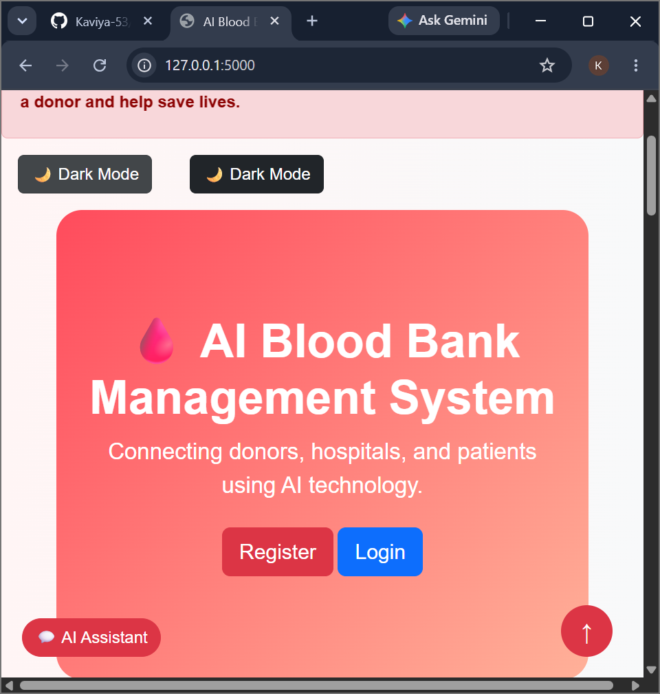
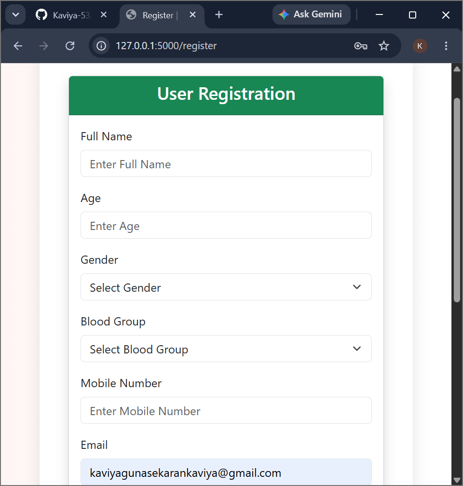
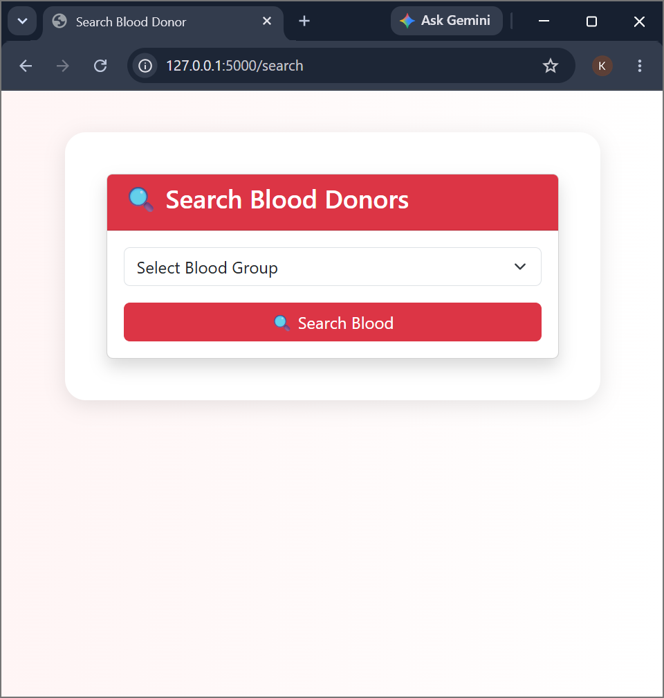
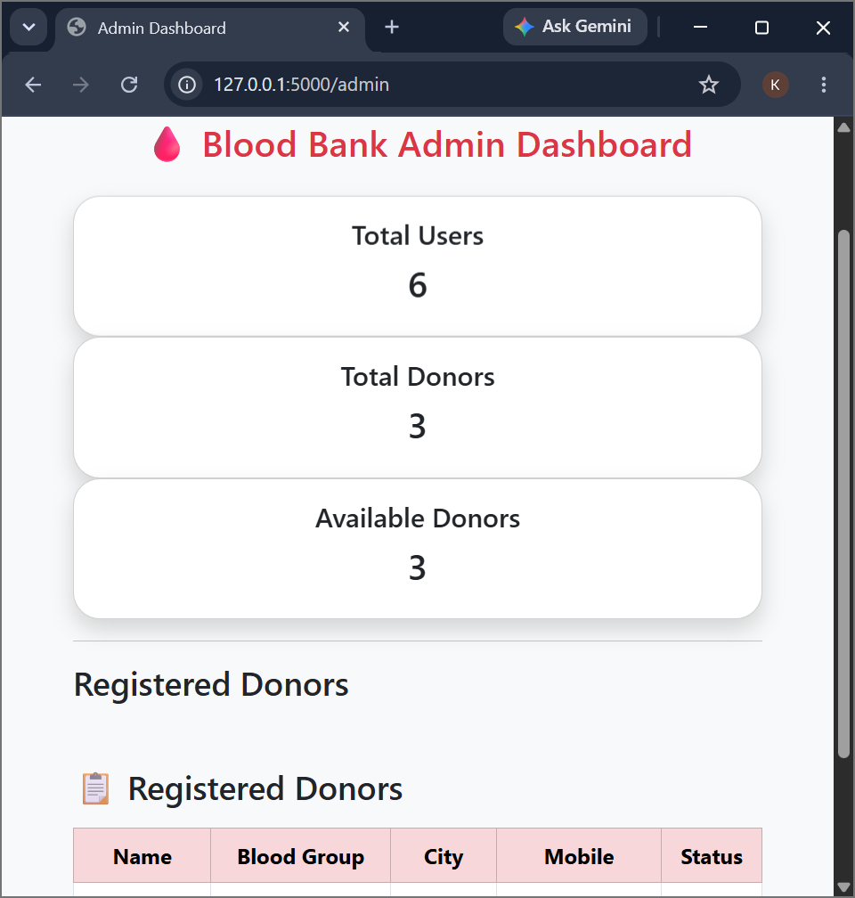

# 🩸 AI-Based Blood Bank Management System

## 📌 Project Overview

AI-Based Blood Bank Management System is a web-based application that connects blood donors, hospitals, and patients through an intelligent platform.

The system helps users register as donors, search for available blood donors, send emergency blood requests, and manage blood bank activities efficiently.

---

## 🎯 Problem Statement

During emergency situations, finding the required blood group quickly is difficult. This project provides a digital platform to reduce the time required for searching and managing blood donors.

---

## 🚀 Features

- User Registration and Login
- Donor Registration
- Search Blood Donors
- Emergency Blood Request
- Admin Dashboard
- Blood Availability Management
- AI-based donor matching
- User-friendly interface

---

## 🛠️ Technologies Used

### Frontend
- HTML
- CSS
- Bootstrap

### Backend
- Python
- Flask

### Database
- MySQL

### Other Tools
- GitHub
- Matplotlib

---

## 📂 Project Structure

---

## 📸 Screenshots

### Home Page


### Login Page


### Register Page


### Donor Page


### Admin Page


---

## ▶️ How to Run the Project

1. Install required packages

```bash
pip install -r requirements.txt


---

## Step 4 – Add Future Enhancements

Below that paste:

```markdown
---

## 🔮 Future Enhancements

- AI-based blood demand prediction
- Mobile application support
- SMS notification for emergency blood requests
- Real-time donor location tracking

---

## 👩‍💻 Developed By

**Kaviya G**  
B.Tech - Computer Science and Business Systems